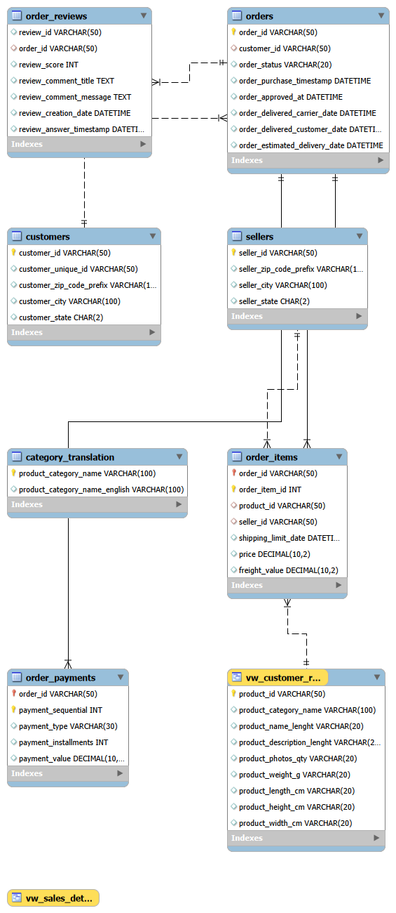

# E-Commerce Sales, Customer & Delivery Analytics (SQL)

## Overview
SQL analysis of ~100K orders from the Olist Brazilian marketplace (2016-2018), covering revenue trends, customer retention, delivery performance, and seller performance. Cleaned views feed a Tableau dashboard (next step).

## Dataset
[Olist Brazilian E-Commerce Public Dataset](https://www.kaggle.com/datasets/olistbr/brazilian-ecommerce) (Kaggle). 8 relational tables: orders, order_items, customers, products, sellers, order_payments, order_reviews, category_translation. The geolocation table is not used.

## Tools
MySQL 8, MySQL Workbench. SQL techniques: JOINs, CTEs, window functions (`LAG`, `NTILE`, `RANK`), views, foreign keys.

## Schema


## Data quality findings
- 96,478 of 99,441 orders are `delivered`; revenue analysis uses these only.
- 8 delivered orders have no delivery date and are excluded from late-delivery analysis.
- 547 orders have more than one review, so reviews are averaged per order before joining to avoid double counting.
- 623 products have no English category name; they keep the original name or are labelled `unknown`.
- 0 orders were delivered before purchase.
- Trends are limited to Jan 2017 - Aug 2018; 2016 and Sep-Oct 2018 have very few orders.
- `customer_unique_id` identifies a person; `customer_id` changes with every order.

## Headline numbers (delivered orders)
- Total orders / customers / revenue / avg order value
  96478 / 93358 / 13221498.11 / 137.04
The marketplace delivered 96478 orders worth 13221498.11 BRL, at about 137.04 per order.

## Key insights
1. **Revenue** grew about 7.5x, from 111.8K BRL (Jan 2017) to 838.6K BRL (Aug 2018). It peaked in Nov 2017 (987.8K BRL, +52.4% MoM, Black Friday) and plateaued through 2018. The Jan 2017 MoM figure is excluded as an outlier because Dec 2016 had only 1 order.
2. **Top categories:** health_beauty (1.23M BRL), watches_gifts (1.17M), bed_bath_table (1.02M). bed_bath_table has the most orders (9,272) but a low value per order; watches_gifts has the highest value per order.
3. **Weak retention:** only 3.00% of customers (2,801 of 93,358) purchased more than once.
4. **Late delivery hurts ratings:** 8.11% of orders (7,826 of 96,470) arrived late. Late orders averaged 2.57 stars versus 4.29 for on-time orders, a 1.72-point gap.
5. **RFM segmentation:** the "At risk" segment (23.3% of customers) holds 37.3% of revenue, making it the best win-back target. Repeat customers are 3.0% of customers and 5.6% of revenue.
6. **Sellers:** 12 of the top 15 sellers by revenue are in SP. The slowest top seller (22.3 days delivery) also has the lowest review score (3.50).
7. **Geography:** SP brings about 38% of revenue and delivers in 8.7 days on average; RR and AP take about 28 days, AM 26 days.

## Notes
- The RFM analysis uses `payment_value` (includes freight), so its totals are higher than the item-price revenue used elsewhere.
- Order counts in the late-vs-on-time review comparison are lower than total delivered orders because some orders have no review.
- Late delivery is linked to low ratings; this analysis does not prove it causes customers to leave.

## How to run
1. Run `sql/01_schema.sql` to create the database and tables.
2. Download the CSVs from Kaggle and load them into the matching tables (for `order_reviews`, use `LOAD DATA INFILE ... ESCAPED BY '' LINES TERMINATED BY '\r\n'`).
3. Run `sql/02_cleaning.sql` (date conversion and foreign keys).
4. Run `sql/03_data_quality_checks.sql`, `sql/04_analysis_queries.sql`, then `sql/05_views.sql`.

## Repository structure
```
sql/      01_schema.sql ... 05_views.sql
data/     sales_detail.csv, customer_rfm.csv (exported from the views)
images/   er_diagram.png and result screenshots
```

## Next steps
Tableau dashboard built on `data/sales_detail.csv` and `data/customer_rfm.csv`.
